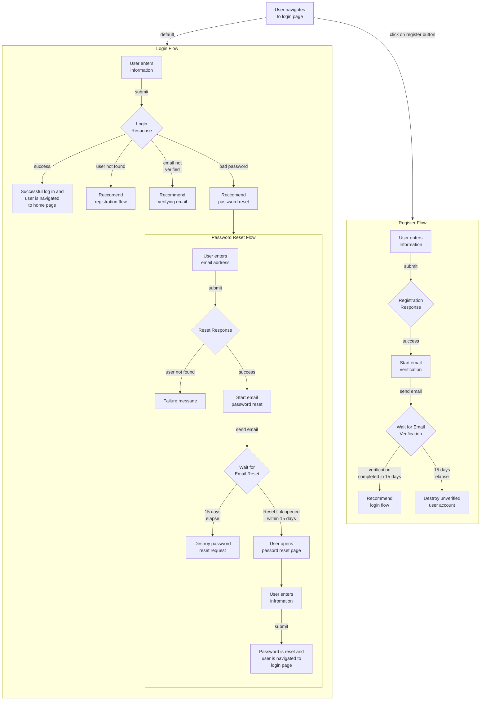

# 001 - Login Flow
**Status**: Proposed
**Created**: 2024-08-11
**Updated**: 2024-08-11

## Context

The site needs a way to register and manage users.

## Proposal
The below workflow is proposed. It will require email verification, which I generally dislike as it requires storing PII. But in exchange, it means less spam / abuse and a way to reset passwords via email link.

